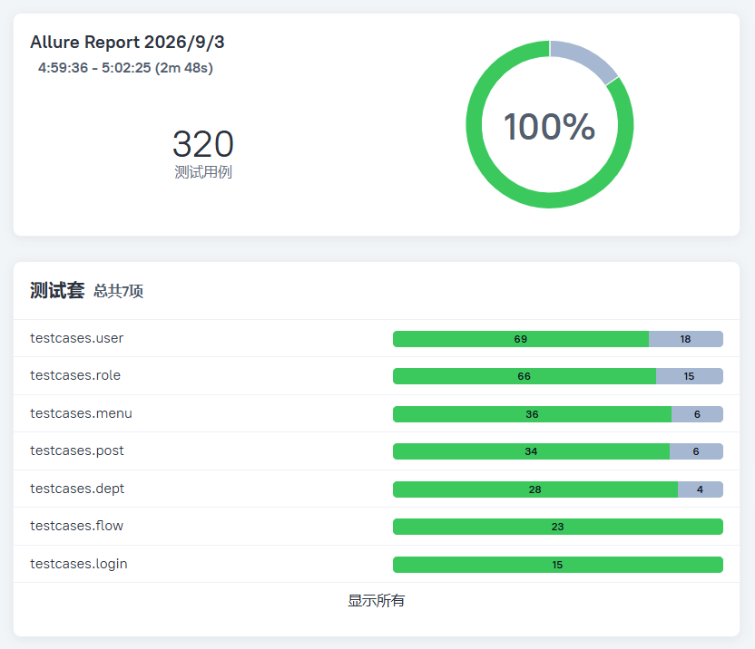
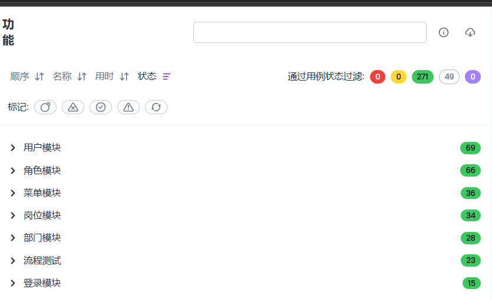

# RuoYi-Vue3-FastAPI 接口自动化测试项目

基于 **pytest + requests + allure** 的 API 自动化测试工程，对开源后台管理系统 **RuoYi-Vue3-FastAPI v1.10.0** 的 6
个核心业务模块（登录 / 用户 / 角色 / 岗位 / 菜单 / 部门）进行系统性的接口测试，并额外设计了 **2 条跨模块端到端流程测试
（管理端配置链路 + 受限角色权限拦截链路）**，累计 **320 条用例**（含 **49 条已知缺陷回归用例**），覆盖 **52 个接口**（核心模块覆盖率
88%）。

---

## 项目背景

本项目是一个面向 **RuoYi-Vue3-FastAPI** 的接口自动化测试实践：

- **被测系统**：[insistence/RuoYi-Vue3-FastAPI](https://github.com/insistence/RuoYi-Vue3-FastAPI) v1.10.0（若依 RuoYi 的
  FastAPI 移植版，MIT 协议开源），后端
  FastAPI + SQLAlchemy + MariaDB + Redis
- **测试目标**：核心系统管理模块的接口功能、参数校验、业务规则与已知缺陷的回归保护
- **测试方式**：接口请求 + **数据库校验**双闭环；关键断言均经**后端源码与实测**双重验证
- **数据隔离**：单模块用例使用"自建自删"模式（工厂 + fixture 清理），不污染种子数据，可重复执行；
  流程测试数据贯穿链路，由流程自身登记并在末尾按依赖倒序回收（见「测试设计」第 6 节）

---

## 技术栈

| 分类       | 技术                            |
|----------|-------------------------------|
| 测试框架     | pytest 9.1.1                  |
| HTTP 客户端 | requests（统一封装 APIClient）      |
| 报告       | allure-pytest 2.16.0          |
| 数据库校验    | PyMySQL（查询/执行/重置）             |
| 环境       | Python 3.14 / Windows / Linux |

---

## 被测系统（内置，clone 即用）

被测系统 **RuoYi-Vue3-FastAPI 后端** 源码已内置在 `vendor/ruoyi-fastapi/`（MIT 协议，保留原作者 LICENSE），仓库同时内置前端
`vendor/ruoyi-frontend/`，**clone 后无需另行下载部署**。

### 第一步：准备环境（一次性）

| 软件      | 要求    | 说明                                                                   |
|---------|-------|----------------------------------------------------------------------|
| Python  | 3.10+ | 安装时勾选 *Add python.exe to PATH*：https://www.python.org/downloads/     |
| MySQL   | 8.x   | 本机 3306 端口，需可用的 root 账号：https://dev.mysql.com/downloads/installer/   |
| Redis   | 任意版本  | 本机 6379 端口（Windows 推荐：https://github.com/tporadowski/redis/releases） |
| Node.js | 18+   | 仅运行前端需要：https://nodejs.org/                                          |

> 启动脚本会自动检测以上环境，缺失时会明确提示如何安装。

### 第二步：一键启动后端（Windows）

双击 `vendor/ruoyi-fastapi/start.bat`，脚本自动完成：

1. 检查 Python / MySQL / Redis / 端口 9099（缺失即提示安装）
2. 创建虚拟环境并安装后端依赖（首次需几分钟，网络慢可先配置 pip 镜像）
3. 创建数据库 `ruoyi-fastapi` 并导入种子数据（已存在则跳过）
4. 关闭登录验证码（后端启动时同步到 Redis，登录无需验证码）
5. 从模板生成 `.env.dev` 配置
6. 检查 Redis 认证（有密码会明确提示）
7. 启动后端

看到 `Uvicorn running on http://0.0.0.0:9099` 即启动成功，浏览器打开 http://127.0.0.1:9099/docs 验证。

### 第三步：启动前端（可选）

```bat
cd vendor\ruoyi-frontend
npm install          :: 首次需要，等待完成
npm run dev
```

浏览器打开 **http://127.0.0.1:8080/**，用 **admin / admin123** 登录（端口 8080 已在配置中固定，避开常见的 80 端口占用）。

### 注意事项

- **MySQL root 密码**不是 `123456` 时：修改 `vendor/ruoyi-fastapi/start.bat` 顶部的 `DB_PWD`
- **Redis 设置了密码**时：修改 `vendor/ruoyi-fastapi/.env.dev` 的 `REDIS_PASSWORD`（脚本启动前自动检测认证，不通过会停下提示）
- **停止后端**：在 start.bat 窗口按 `Ctrl+C`

### 常见问题

| 现象            | 处理                                                                                       |
|---------------|------------------------------------------------------------------------------------------|
| 提示 MySQL 连接失败 | root 密码不是 123456，改 start.bat 顶部 `DB_PWD` 后重跑                                             |
| 提示 Redis 认证失败 | 在 `vendor/ruoyi-fastapi/.env.dev` 填 `REDIS_PASSWORD` 后重跑                                 |
| 依赖安装失败        | 网络问题：`pip install -r requirements.txt -i https://pypi.tuna.tsinghua.edu.cn/simple`（国内镜像） |
| 想重置系统数据       | 删除 `ruoyi-fastapi` 数据库后重跑 start.bat（自动重建 + 导种子数据）                                        |

> 非 Windows 用户：可参照[官方仓库](https://github.com/insistence/RuoYi-Vue3-FastAPI)自行部署被测环境，再通过环境变量
`BASE_URL` / `DB_*` 指向即可。

---

## 目录结构

```
├── config/
│   └── setting.py              # 全局配置（BASE_URL/DB 连接等，支持环境变量覆盖）
├── utils/                      # 工具层
│   ├── api_client.py           # HTTP 客户端封装（统一 URL/超时/日志/异常）
│   ├── function.py             # 数据工厂（make_user/make_role/...，最小必填字段）
│   ├── mysql_helper.py         # 数据库工具（query_one/query_all/execute_sql/reset）
│   ├── login_api.py            # 登录模块接口封装
│   ├── user_api.py             # 用户模块接口封装
│   ├── role_api.py             # 角色模块接口封装
│   ├── post_api.py             # 岗位模块接口封装
│   ├── menu_api.py             # 菜单模块接口封装
│   └── dept_api.py             # 部门模块接口封装
├── data/                       # 数据驱动用例数据（JSON）
│   ├── login/  user/  role/  post/  menu/  dept/
├── testcases/                  # 测试用例（按模块分目录）
│   ├── conftest.py             # 全局 fixtures（client/token/api/mysql/creat_xxx）+ allure 钩子
│   ├── login/  user/  role/  post/  menu/  dept/
│   │   └── *_smoke_test.py     # 各模块冒烟测试（主链路闭环）
│   │       *_creat_test.py     # 添加类用例（数据驱动 + 边界 + 缺陷）
│   │       *_query_test.py     # 查询类用例（筛选/详情/异常路径）
│   │       *_manage_test.py    # 管理类用例（编辑/删除/排序/状态）
│   └── flow/                   # 跨模块端到端流程测试（2 条链路，23 条）
│       ├── admin_config_flow_test.py     # 链路1：管理端配置全流程（建人→菜单→角色→授权→登录→验证→清理）
│       └── role_permission_flow_test.py  # 链路2：受限角色权限拦截（有权限放行/无权限403/admin对照）
├── scripts/
│   └── reset_mysql.sql         # 数据库重置脚本（CI/环境初始化用）
└── vendor/
    ├── ruoyi-fastapi/          # 被测系统后端源码（内置，含 start.bat 一键启动）
    └── ruoyi-frontend/         # 被测系统前端源码（内置，npm run dev 启动）
```

---

## 快速开始

> 前置条件：被测系统已启动（见上方「被测系统」章节，双击 start.bat 即可）。

```bash
# 1. 创建虚拟环境并安装依赖
python -m venv .venv
.venv\Scripts\activate          # Windows；Linux/macOS 用 source .venv/bin/activate
pip install -r requirements.txt

# 2. 配置被测环境（使用内置被测系统时指向本机，否则覆盖为你的被测地址）
set BASE_URL=http://127.0.0.1:9099/        # Windows（内置被测系统已启动）
export BASE_URL=http://127.0.0.1:9099/     # Linux/macOS
# 数据库连接可整体覆盖：DB_HOST / DB_PORT / DB_USER / DB_PASSWORD / DB_NAME

# 3. 运行测试
pytest                              # 全量 320 条
pytest -m smoke                     # 仅冒烟（32 条）
pytest -m flow                      # 仅流程测试（23 条，跨模块端到端，见「测试设计」第 6 节）
pytest -m user                      # 指定模块（具体可从config.setting中查看）
pytest testcases/role/              # 也是指定模块
pytest testcases/flow/              # 也是指定流程目录
pytest testcases/menu/menu_manage_test.py -k "delete"   # 指定用例

# 4. 生成 allure 报告（allure 命令行需单独安装：Windows 用 scoop install allure，macOS 用 brew install allure）
pytest --alluredir=reports/allure-results --clean-alluredir
allure serve reports/allure-results
```

---

## 测试设计

### 1. 分层架构

```
用例层（testcases） → 接口封装层（utils/*_api.py） → HTTP 客户端（utils/api_client.py） → 被测后端
                    ↘ 数据工厂（utils/function.py） → 数据库工具（utils/mysql_helper.py）
```

- **接口封装层**：URL、认证头、请求体结构集中管理，用例层只传业务参数
- **数据工厂**：`make_xxx` 构造最小必填数据（字段依据模型层校验规则），时间戳保证唯一
- **fixture 自清理**：`creat_xxx` 工厂创建成功后登记，teardown 统一删除，**只登记真实创建成功**
  的记录，失败用例（601/500/422）不会产生孤儿数据；部门按逆序清理（子部门先删）

### 2. 用例结构（每个模块四类文件）

| 文件                    | 职责                      |
|-----------------------|-------------------------|
| smoke                 | 主链路闭环（增→查→改→删），含数据库落库校验 |
| creat                 | 添加类：数据驱动成功/失败/缺陷 + 长度边界 |
| query                 | 查询类：特有筛选字段 + 详情异常路径     |
| manage                | 管理类：编辑/删除/排序的业务规则与事务回滚  |
| authuser<br/>authrole | 分配角色给用户（上），分配用户给角色（下）   |
| other                 | 在登录模块中使用，表示除了冒烟测试之外的部分  |

### 3. 去重原则（dedup）

- **同一校验函数**（如 add/edit 共用的唯一性检查）只在添加侧测试，编辑侧不重复
- **框架级行为**（分页边界、时间解析、全局异常）在用户模块做代表覆盖，其他模块不重复
- **同构逻辑**（如菜单/部门的 updateSort 参数解析）只在一个模块测全，另一个只测成功
- **字段格式校验**（邮箱/电话的格式与长度）用户模块已覆盖，部门模块则不测

### 4. 数据库校验的使用场景

- API 层面无法证明的事实（如"分配假成功"插入的孤儿关联，列表接口 JOIN 用户表查不到，必须查 `sys_user_role` 表）
- 事务回滚的落库证明、软删除（del_flag）验证
- 测试结束后的残留确认

### 5. 失败现场自动化

conftest 的 `pytest_runtest_makereport` 钩子：用例失败时自动把最近一次请求/响应 attach 到 allure 报告；xfail
缺陷用例同样记录缺陷现场，便于缺陷分析。

### 6. 流程测试（跨模块端到端，23 条）

定位：单模块用例以 admin（`*:*:*` 全量权限）身份执行，权限校验恒放行，无法覆盖两类集成行为——
**无权限请求的拦截**与**多模块配置组合后的真实生效**。流程测试以受限业务身份串联多模块接口，
专项验证这两类场景。`testcases/flow/` 共 2 条链路、23 条用例：

| 链路         | 文件                             | 条数 | 链路编排                                                                                               |
|------------|--------------------------------|----|----------------------------------------------------------------------------------------------------|
| 管理端配置链路    | `admin_config_flow_test.py`    | 13 | 建用户→建部门/岗位→建三级菜单(目录/菜单/按钮)→建角色挂菜单权限→给用户配岗位部门角色→新用户登录→getInfo 验证配置全部生效→退出→按依赖倒序清理                   |
| 受限角色权限拦截链路 | `role_permission_flow_test.py` | 10 | 最小权限角色(仅挂 1 个菜单权限)→getInfo 验证权限面最小(无 `*:*:*`)→有权限接口放行(200)→无权限接口被业务码 403 拦截→admin 同接口对照(200)→退出→清理 |

#### 管理端配置链路的设计要点

- **配置生效的端到端验证**：链路终点以新用户登录 + getInfo 回查，验证"建的用户/部门/岗位/菜单/角色
  及其相互绑定"全部真实生效，而不只是创建接口返回成功——覆盖"多模块配置组合后真实生效"这一集成行为。

#### 受限角色权限拦截链路的设计要点

- **最小权限设计**：受限角色仅挂载单一菜单权限（`system:user:list`），权限面最小、
  允许/拒绝边界清晰，使断言粒度精确到单个权限串。
- **对照组设计**：同一接口以受限用户与 admin 双身份调用——受限用户被 403 拦截、
  admin 正常 200，证明拦截源于权限缺失而非接口或环境故障。

#### 两条链路共有的设计要点

- **链路编排与数据传递**：用例按业务步骤定义执行顺序，前置用例创建的资源 ID 经模块级变量登记传递，
  后置用例接力使用，形成"创建→授权→验证→回收"的完整数据链；用例间存在数据依赖，整类须按序执行。

- **资源生命周期管理**：流程内资源由流程自身创建、登记并统一回收，回收顺序遵循后端业务校验约束
  （用户→角色→菜单子级先于父级→部门/岗位），保证链路可重复执行、不留数据残留。

---

## 已发现的缺陷（节选，均经源码与实测双重确认）

> 📋 完整 49 条缺陷清单（含模块分布、实测表现、修复优先级）见 [docs/defects.md](docs/defects.md)

| # | 模块    | 缺陷描述                            | 表现                                                                      |
|---|-------|---------------------------------|-------------------------------------------------------------------------|
| 1 | 角色/用户 | 分配接口不校验目标存在性                    | 分配不存在的用户/角色返回成功，`sys_user_role` 插入孤儿关联 (999,2)                          |
| 2 | 全局    | 兜底异常把内部错误原文返回给客户端               | 例如：编辑不存在部门（`PUT /system/dept`，deptId=999）泄漏 SQLAlchemy "0 were matched" |
| 3 | 角色    | 编辑缺 `menuIds` 时 KeyError 崩溃     | 500 泄漏内部键名 `menu_ids`                                                   |
| 4 | 菜单/部门 | 新增时未校验父级存在性                     | parentId=9999 创建成功，产生孤儿数据                                               |
| 5 | 用户    | 手机号仅做上限长度校验，无格式/最小长度校验          | 传字母、10 位数字均创建成功                                                         |
| 6 | 多个模块  | 删除不存在的记录返回"删除成功"                | 岗位/角色/部门/菜单删除 id=999 均返回 200「删除成功」（无存在性校验）                              |
| 7 | 菜单    | 保存排序含不存在的ID时本应报错，但计算机却静默更新了 0 行 | 计算机没有更新任何有效数据，返回200「保存成功」属于假成功                                          |
| 8 | 多个模块  | 备注字段无长度校验                       | 超过 500 字符返回 500 并泄漏 SQL/表结构                                             |

> ⚠️ 上表缺陷中，除「备注字段无长度校验」外，其余均已被前端约束拦截，真实用户无法触发；备注超长无前端约束（如粘贴超长文本），且返回
> 500 泄漏 SQL/表结构，风险最高。

> 以上缺陷均可现场用 pytest 复现：命中缺陷均用xfail装饰标注「已知缺陷 + 前端已约束」，后端修复后会自动 XPASS
> 提醒，作为回归保护。，并自动把最近一次请求/响应附加到 Allure 报告（见 conftest 的 `pytest_runtest_makereport` 钩子），便于定位。

---

## 覆盖统计（截至当前）

| 单模块    | 用例数     | 接口数（已测/总）             |
|--------|---------|-----------------------|
| 登录     | 15      | 4 / 6                 |
| 用户     | 87      | 14 / 18               |
| 角色     | 81      | 13 / 14               |
| 岗位     | 40      | 6 / 6                 |
| 菜单     | 42      | 8 / 8                 |
| 部门     | 32      | 7 / 7                 |
| **合计** | **297** | **52 / 59（核心模块 88%）** |

| 模块 | 用例数 | 详细说明                  |
|----|-----|-----------------------|
| 通过 | 248 | 此数据为在单模块测试时通过的用例      |
| 流程 | 23  | 全部复用单模块接口，且为全通过，无缺陷   |
| 缺陷 | 49  | 单模块中已发现的缺陷数量(xfail标记) |
| 合计 | 320 | 此数据为目前所测用例的总数，未完待续    |

### 测试报告截图（Allure）






---

## 许可证

本项目基于 MIT License 开源，详见 [LICENSE](LICENSE) 文件。
被测系统 RuoYi-Vue3-FastAPI 遵循其原始 MIT 许可证
